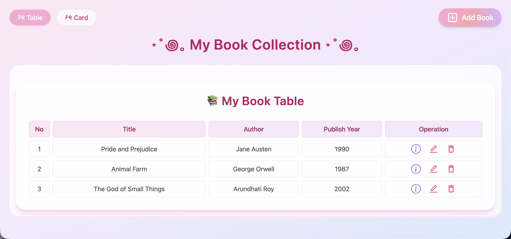
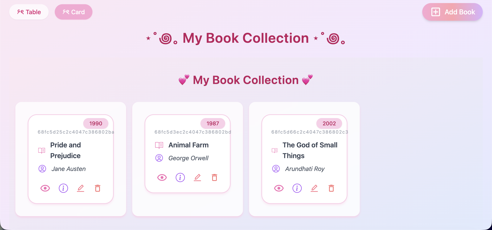
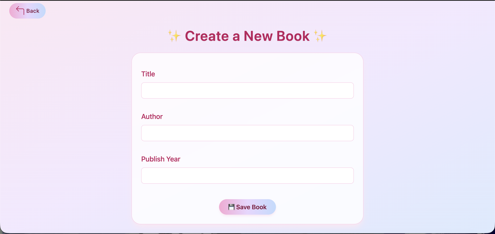
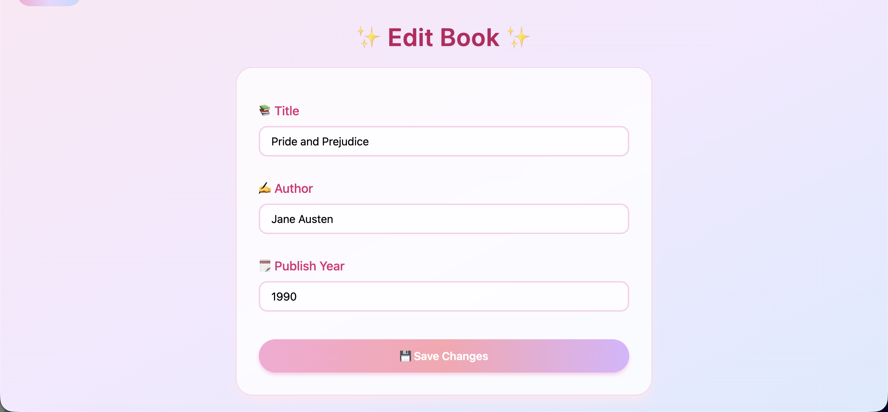
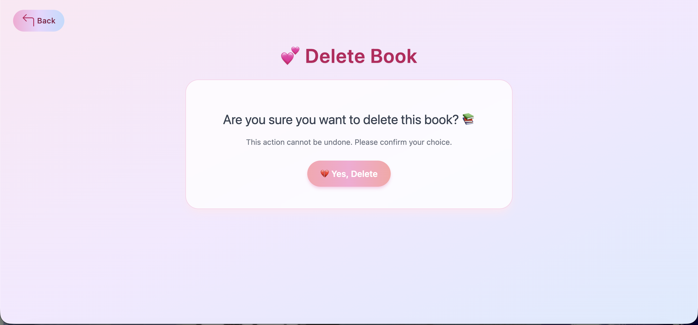

# 🌸 My Book Collection (MERN App)

A pastel-themed full-stack **MERN Book Collection App** that allows users to create, view, edit, and delete books in a clean, aesthetic UI.  
Built using **MongoDB**, **Express**, **React (Vite)**, and **Node.js**, styled beautifully with **Tailwind CSS**.

---

## ✨ Features
- 📚 View all books in both table and card views  
- ➕ Add new books  
- 📝 Edit existing book details  
- ❌ Delete books  
- 🪄 Clean and modern pastel design  
- 🌈 Responsive layout built with TailwindCSS  

---

## 🖼️ Screenshots

### 🏠 Home Page


### 🧾 Card View


### 🆕 Add / Create Book


### ✏️ Edit Book


### 📖 Book Details


### 🗑️ Delete Book


---

## 🧠 Tech Stack

**Frontend:** React + Vite + TailwindCSS  
**Backend:** Node.js + Express  
**Database:** MongoDB (Mongoose)  

---

## ⚙️ Setup Instructions

### 1️⃣ Clone the Repository
```bash
git clone https://github.com/yourusername/mern-book-collection.git
cd mern-book-collection
```

### 2️⃣ Install Dependencies
Backend:
```bash
cd backend
npm install
```
Frontend:
```bash
cd ../client
npm install
```
### 3️⃣ Setup Environment Variables

In your /backend folder, create a .env file:
```bash
MONGO_URI=your_mongodb_connection_string
PORT=5001
```
### 4️⃣ Run the App

Backend:
```bash
npm run dev
```

Frontend:
```bash
npm run dev
```

Your app should now be running at:
🔗 Frontend: http://localhost:5173

🔗 Backend: http://localhost:5001

---

### 🧩 Folder Structure
```bash
mern-book-collection/
│
├── assets/               # Project screenshots
│   ├── homePage.png
│   ├── card.png
│   ├── create.png
│   ├── edit.png
│   ├── details.png
│   └── delete.png
│
├── backend/              # Express + MongoDB API
│   ├── controller/
│   ├── models/
│   ├── routes/
│   ├── config.js
│   ├── index.js
│   └── .env
│
├── client/               # React + Vite frontend
│   ├── src/
│   ├── public/
│   └── index.html
│
└── README.md
```

### 🚀 Future Enhancements

- 🔐 Add login/signup authentication

- 🖼️ Allow book cover uploads

- 🔎 Add search and filter functionality

- 🌙 Add dark/light mode toggle

### 💖 Author

- Ankita Tripathi
- 📧 ankitatripathi2006@gmail.com

--- 
